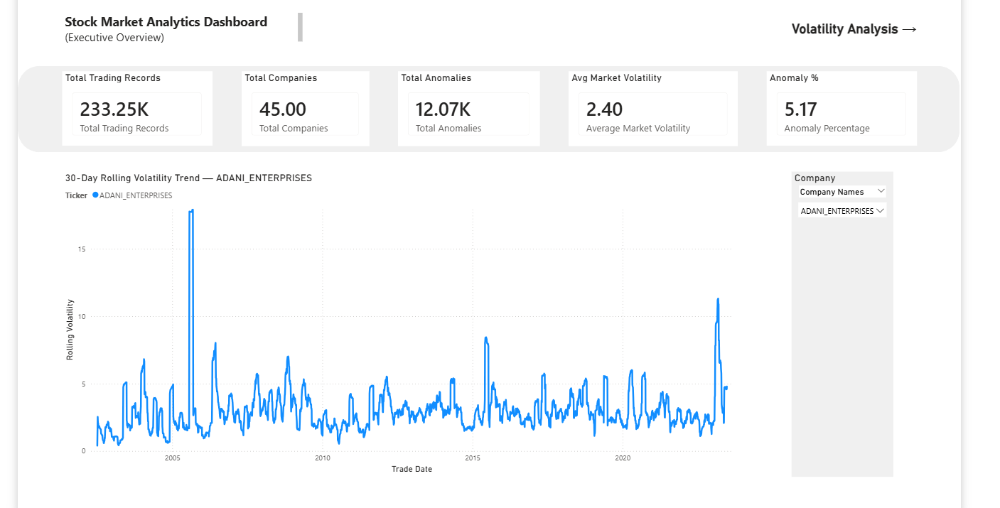
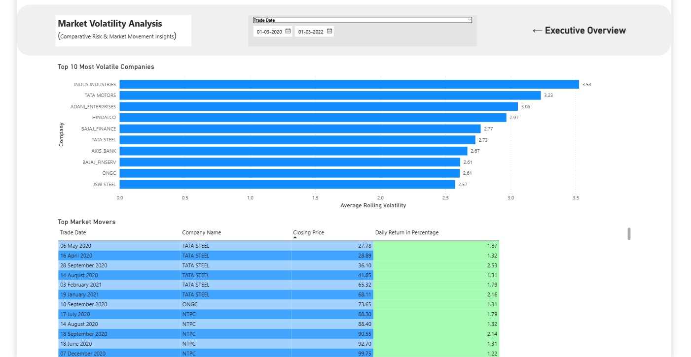

# Stock Market Analytics Dashboard

End-to-end stock market analytics engineering project built using SQL Server and Power BI.

This project consolidates historical NIFTY 50 stock datasets into a centralized analytical platform for anomaly detection, volatility analysis, KPI reporting, and interactive business intelligence dashboards.

---

# Project Overview

This project simulates a real-world analytics engineering workflow by building a scalable ETL pipeline for multi-company stock market data ingestion and analysis.

The system automatically processes multiple CSV files, standardizes historical stock data, performs validation checks, and prepares the dataset for advanced analytical querying and Power BI visualization.

The project focuses on:
- Automated SQL-based ETL pipelines
- Data quality validation
- Financial anomaly detection
- Volatility analysis
- Business-oriented KPI reporting
- Interactive Power BI dashboards

---

# Dashboard Preview

## Executive Overview



## Volatility Analysis



---

# Business Problem

Financial markets generate massive amounts of historical trading data across multiple companies and time periods.

The challenge is transforming fragmented stock market datasets into a centralized analytical platform capable of:
- detecting volatility spikes,
- identifying abnormal market movements,
- comparing company-level stock behavior,
- and delivering interactive business intelligence insights for decision-making.

This project simulates a real-world analytics engineering workflow by building a scalable SQL Server + Power BI analytics solution for stock market analysis.

---

# Technology Stack

| Component | Technology |
|---|---|
| Database | Microsoft SQL Server 2022 |
| Analytics | Advanced SQL |
| Visualization | Microsoft Power BI Desktop |
| Version Control | Git & GitHub |
| Development Environment | VS Code + SSMS |

---

# Dataset Information

- Dataset: NIFTY 50 Historical Stock Market Data
- Time Period: 2000 – 2023
- Companies Processed: 45 companies
- Total Records Loaded: 233,000+ rows
- Source Format: Multiple CSV files

Dataset Source:

https://www.kaggle.com/datasets/rockyjoseph/nifty-50-stock-market-data-2000-2023

---

# Database Architecture

The project follows a layered ETL architecture.

## Raw Ingestion Layer
- Dynamic CSV ingestion
- Raw file buffering
- Metadata-driven processing

## Staging Layer
- Data type standardization
- Date normalization
- Numeric conversion handling
- Source tracking & audit columns

## Core Analytical Layer
- Star schema dimensional modeling
- Fact and dimension table architecture
- Analytical data preparation

## Analytics Layer
- Window function analysis
- Rolling volatility calculations
- Market anomaly detection
- KPI generation

---

# Automated ETL Workflow

The ingestion pipeline automatically:

1. Reads all CSV filenames dynamically using SQL Server
2. Processes files using metadata-driven dynamic SQL
3. Performs automated BULK INSERT operations
4. Standardizes raw stock market data
5. Loads transformed data into staging tables
6. Handles schema inconsistencies and validation checks
7. Loads analytical data model for reporting

---

# SQL Concepts Demonstrated

- Dynamic SQL
- BULK INSERT automation
- WHILE loops
- TRY_CONVERT()
- Window Functions (LAG, LEAD, AVG OVER)
- Common Table Expressions (CTEs)
- Analytical aggregations
- Star schema dimensional modeling
- Data quality validation
- Index optimization

---

# Power BI Dashboard Features

- Executive KPI reporting
- Interactive slicers and filtering
- Dynamic DAX-driven chart titles
- Top-N volatility ranking analysis
- Time-series stock volatility trends
- Conditional formatting for market movement analysis
- Multi-page dashboard navigation
- Comparative company-level analytics

---

# Data Quality & Validation

The project includes validation checks for:
- NULL detection
- Duplicate records
- Invalid price values
- Date validation
- Financial OHLC integrity checks
- Schema inconsistency handling

Files with inconsistent schemas were isolated during ingestion validation to preserve staging integrity.

---

# Project Results

- Consolidated 233,000+ stock market records
- Processed 45 NIFTY 50 companies
- Built automated SQL-based ETL pipeline
- Developed dimensional analytical data model
- Created interactive Power BI dashboards
- Implemented rolling volatility and anomaly analysis
- Designed portfolio-ready analytics engineering solution

---

# Project Structure

```text
stock-market-analytics-dashboard/
│
├── data/
│   ├── raw/
│   ├── processed/
│   └── exports/
│
├── sql/
│   ├── 01_database_setup/
│   ├── 02_staging/
│   ├── 03_data_quality/
│   ├── 04_core_model/
│   ├── 05_analytics/
│   ├── 06_views/
│   ├── 07_performance/
│   └── 08_validation/
│
├── powerbi/
│   ├── pbix/
│   └── screenshots/
│
├── docs/
├── images/
└── README.md
```
---

# Data Setup Instructions

## Step 1 — Download Dataset

Download dataset from Kaggle:

https://www.kaggle.com/datasets/rockyjoseph/nifty-50-stock-market-data-2000-2023

---

## Step 2 — Extract Dataset

Extract all CSV files into:

```text
data/raw/
```

Example:

```text
stock-market-analytics-dashboard/data/raw/RELIANCE.csv
```

---

## Step 3 — Execute SQL Scripts

Run scripts in the following order:

```text
00_enable_xp_cmdshell.sql
01_create_staging_table.sql
02_single_file_ingestion_test.sql
03_create_raw_import_table.sql
04_automated_multi_file_ingestion.sql
```

---

# Planned Analytics & Dashboard Features

- Stock volatility analysis
- Rolling average calculations
- Price anomaly detection
- LAG/LEAD comparative analysis
- Trading volume analysis
- KPI dashboards
- Interactive Power BI filtering
- Time-series visualization

---

# Author

## Darshan Tada

- GitHub: https://github.com/Darshantada10
- LinkedIn: https://linkedin.com/in/darshantada
- Email: darshantadaofficial@gmail.com